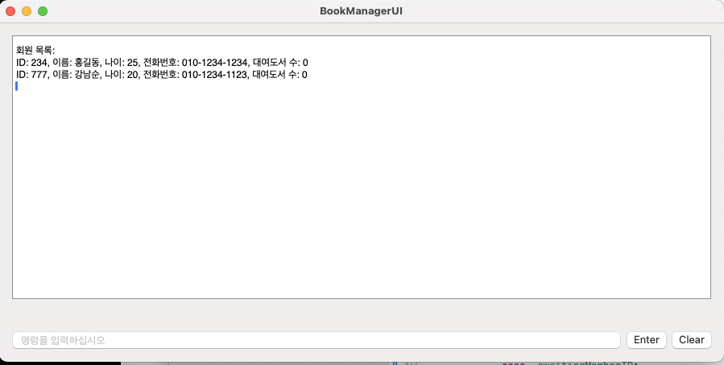

# bookmanagerUI

#### 2023.11.20
- 사용자 입력 기능 추가
- 유의사항
 - 회원관리 > 회원등록 > (회원등록시작 함)
 - 순차적으로 이름, 나이, 회원번호(1~5는 입력금지), 전화번호 입력
 - 회원 리스트 확인
  - 회원관리 > 회원목록 보기 (아래화면 참조) 

- 

#### 2023.11.12
- swiftUI를 이용하여 사용자 입력 값을 받은 후 메뉴이동 가능한 예제
- 

